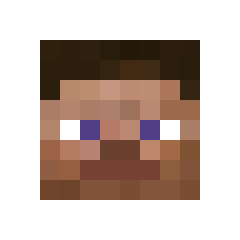

<h1>
  <p align="center">
    Skindentity
  </p>

  <p align="center">
    <a href="https://discord.gg/dmKMAMf">
      
    </a>
    <a href="https://go.deta.dev/deploy">
      
    </a>
    <a href="https://heroku.com/deploy">
      
    </a>
  </p>
</h1>

**Skindentity** is a python library for rendering Minecraft skins. Works as a Rest API using the [FastAPI](https://fastapi.tiangolo.com/) library.

Mainly meant for server admins who want to display their players outside of the game.

## Current APIs

> #### For an interactive version of the API, [click here](https://skindentity.deta.dev/).

### skindentity.deta.dev/portrait/


### skindentity.deta.dev/face/


### skindentity.deta.dev/skin/


> #### You can set `MHF_Steve` as the name to use the default Steve skin.

### Arguments

|Value|Type|Description|Default|
|-|-|-|-|
|`player_name`|`str`|What player's skin to use|
|`skin_url`|`str`|Link to get an image|
|`skin_base64`|`str`|Base64 encoded image|
|`slim`|`bool`|Whether or not to render skins with slim arms|`false`
|`overlay`|`bool`|Whether or not to display the skin's overlay|`false`
|`margin`|`int`|How many pixels around the image to make transparent. (1 to 8)|`0`
|`upscale`|`int`|How many times to increase the size of a pixel. (2 to 8)|`1`

## How To Contribute

Want to render a skin another way? You can do that by adding your own rendering API.

To do this, create a new function inside of [renders.py](renders.py), with `skin` and `slim` as the arguments.

- The `skin` argument is an `Image` object provided by Pillow, which you can manipulate into your own render.

- The `slim` argument is a Boolean that determines whether the skin image has a slim model type or not.

Inside of the function, add your own code for turning the image into your own render, then `return` the render.

> #### I'd recommend using the Pillow library (`pip install pil -user`), it allows you to edit images programmatically, and it is already included in the [requirements.txt](requirements.txt) file of the repository.

```py
from PIL import Image

def new_render(skin: Image, slim: bool) -> Image:
    final_image = Image.new()
    # your code for rendering
    return final_image
```

Then, add a new definition inside of [main.py](main.py), with an `app.get('/api_name/')` decorator, and `args: template_args = Depends()` as the only argument.

- The `app.get('/api_name/')` decorator tells the website which path needs to be entered to use your render.

- The `args: template_args = Depends()` argument tells the API to use the same arguments as the other APIs. This is so each API is easy to switch around.

Inside of the function, return the results of the `api_template()` function with `args`, `render_function` and `'cached_renders_path/'` as the arguments.

- `args` passes the default arguments to the template.
- the `render_function` argument is the function defined in [renders.py](renders.py), which gets called to process the image.
- the `'cached_renders_path/'` argument is the path to cache images in. (After `'/tmp/'`)
- The `api_template()` function sends all of the data for processing, and returns the rendered image.

```py
@app.get('/api_name/')
async def render_name(args: template_args = Depends()):
    return api_template(args, render_function, 'cached_renders_path/')
```

Anyone with any web design knowledge can also contribute by redesigning the interactive website.

###### Psst, looking for a place to host your API for free? Check out [DETA](https://www.deta.sh/), they're pretty cool.
