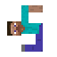
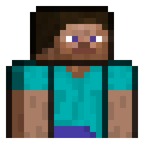
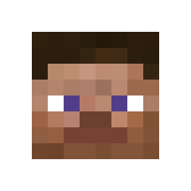
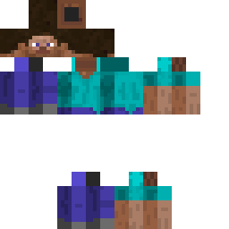

<h1>
  <p align="center">
    Skindentity
  </p>

  <p align="center">
    <a href="https://discord.gg/dmKMAMf">
      
    </a>
    <a href="https://go.deta.dev/deploy">
      
    </a>
    <a href="https://heroku.com/deploy">
      
    </a>
  </p>
</h1>

Python FastAPI with a collection of Minecraft Skin rendering APIs.

This API is mainly meant for server owners or administrators who want to add fancier icons to their GUIs.

## Current APIs

### `https://skindentity.deta.dev/portrait/?player=<name>`


### `https://skindentity.deta.dev/profile/?player=<name>`


### `https://skindentity.deta.dev/skin/?player=<name>`


> #### You can set `MHF_Steve` as the name to use the default Steve skin.

### Arguments

|Value|Type|Description|Default|
|-|-|-|-|
|`player`|`str`|Which player's skin to use
|`image_url`|`str`|Link to get an image from
|`slim`|`bool`|Render skins with slim arms|`false`

#### For an easier time figuring out how to use the API, [click here](https://skindentity.deta.dev/docs).

### Planned Arguments

|Value|Type|Description|Default|
|-|-|-|-|
|`overlay`|`bool`|Whether or not to display the skin's overlay|`false`
|`padding`|`int`|How many pixels around the image to make transparent (1 to 6) (set to 2 to fit inside circles)|0
|`upscale`|`int`|What factor to upscale the image by (2 to 30)|0

## How To Contribute

Want to render a skin another way? You can do that by adding your own rendering API.

To do this, create a new function inside of [renders.py](renders.py), with `skin` and `slim` as the arguments.

- The `skin` argument is an `Image` object provided by Pillow, which you can manipulate into your own render.

- The `slim` argument is a Boolean that determines whether the skin image has a slim model type or not.

Inside of the function, add your own code for turning the image into your own render, then `return` the render.

> #### I'd recommend using the Pillow library (`pip install pil -user`), it allows you to edit images programmatically, and it is already included in the [requirements.txt](requirements.txt) file of the repository.

```py
from PIL import Image

def new_render(skin: Image, slim: bool) -> Image:
    final_image = Image.new()
    # your code for rendering
    return final_image
```

Then, add a new definition inside of [main.py](main.py), with an `app.get('/api_name/')` decorator, and `args: template_args = Depends()` as the arguments.

- The `app.get('/api_name/')` decorator tells the website which path needs to be entered to use your render.

- The `args: template_args = Depends()` argument tells the API to use the same arguments as the other APIs. This is so each API is easy to switch around.

Inside of the function, return the results of the `api_template()` function with `args` (the default arguments), `new_method` (defined in [renders.py](renders.py)) and a new deta drive object (`deta.Drive('new drive')`) as the arguments.

- The `api_template()` function sends all of the data back for further processing, and returns the rendered image.

```py
@app.get('/api_name/')
async def new_api(args: template_args = Depends()):
    return api_template(args, new_render, deta.Drive('new_renders'))
```

#### Psst, want to host your own API for free? Go check out [DETA](https://www.deta.sh/), they're pretty cool.
